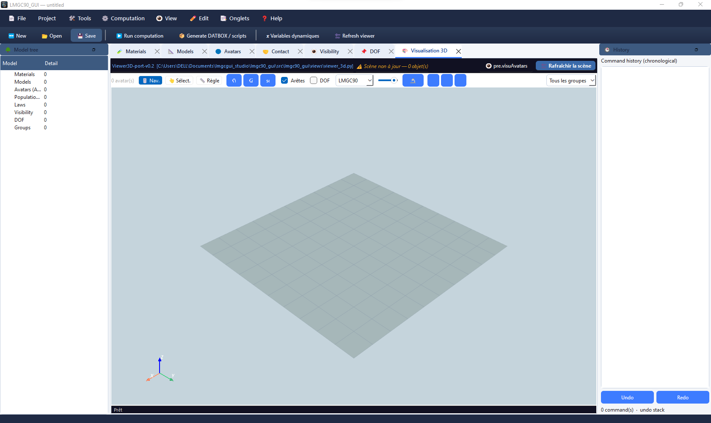

# LMGC90 GUI Studio

Monorepo pour construire, visualiser et exporter des scènes **LMGC90** (DEM / contact) 



Avec une architecture découplée :

| Package | Rôle | Dépendances lourdes |
|---------|------|---------------------|
| **`lmgc90_core`** | Modèle de données pur (matériaux, modèles, avatars, lois, boucles, granulo SoA, maçonnerie) + génération de scripts `pre.py` | **aucune** (Python + NumPy) |
| **`lmgc90_engine`** | Pont vers **pylmgc90** : matérialisation live, DATBOX, `pre.visuAvatars`, workers | **pylmgc90 optionnel** |
| **`lmgc90_gui`** | Client **PyQt6** (MVC) : onglets CRUD, assistants, Viewer3D, journal, calcul | Qt ; PyVista optionnel |

Tu peux **n’installer que le core**, construire un jeu de données (projet `.lmgc90` / scripts), puis ajouter engine + GUI plus tard — sans réécrire la scène.

```
lmgc90gui_studio/
├── lmgc90_core/          # scientifique pur
├── lmgc90_engine/        # bridge pylmgc90
├── lmgc90_gui/           # interface Qt
├── examples/             # scènes de démo (si présentes)
├── docs/                 # notes / exemples documentés
├── install.ps1           # install Windows rapide
├── pyproject.toml        # méta (ne remplace pas les 3 packages)
└── README.md             # ce fichier
```

---

## Architecture

```text
                    ┌─────────────────────────────────────┐
                    │           lmgc90_gui (Qt)           │
                    │  ProjectController · onglets · UI   │
                    └───────────────┬─────────────────────┘
                                    │
                    ┌───────────────▼─────────────────────┐
                    │         lmgc90_engine               │
                    │  EngineSession · materialize        │
                    │  writeDatbox · visuAvatars          │
                    └───────────────┬─────────────────────┘
                                    │  (si pylmgc90 dispo)
                    ┌───────────────▼─────────────────────┐
                    │         lmgc90_core                 │
                    │  Project · entities · ForLoop       │
                    │  granulo SoA · masonry · emit pre   │
                    └─────────────────────────────────────┘
```

- **Core** : source de vérité. Sérialisation projet, noms 5 caractères LMGC90, dimension, expressions / boucles.
- **Engine** : ne possède pas la scène ; il **matérialise** un `Project` en objets `pylmgc90.pre` quand la lib est importable.
- **GUI** : ne stocke pas de corps pylmgc dans le contrôleur ; la session engine détient les objets live après `materialize()`.

Sans pylmgc90, tu gardes : édition de projet, export scripts `pre.py` / `command.py`, Viewer3D **paramétrique** (PyVista).  
Avec pylmgc90 : DATBOX réel, `pre.visuAvatars`, dépôt granulo natif, etc.

---

## Prérequis

- **Python ≥ 3.10**
- **NumPy**
- **Optionnel GUI** : `PyQt6`
- **Optionnel Viewer 3D** : `pyvista`, `pyvistaqt`
- **Optionnel calcul LMGC90** : **pylmgc90** (install depuis les **sources** / env **conda**, pas sur PyPI public classique)

---

## Installation progressive (recommandé)

### Étape A — Core seul (données + scripts, headless)

```bash
cd lmgc90gui_studio
pip install -e ./lmgc90_core
```

Exemple minimal :

```python
from lmgc90_core import pre, Project

p = Project(name="demo", dimension=2)
p.add(pre.material(name="STEEL", materialType="RIGID", density=7800.0))
p.add(pre.model(name="rigid", physics="MECAx", element="Rxx2D", dimension=2))
p.add(pre.rigidDisk(r=0.1, center=[0.0, 0.0], model="rigid", material="STEEL"))

# Persistance / scripts (API du package — voir lmgc90_core/README.md)
print(p.summary())
```

Tu peux ainsi **créer et versionner un jeu de données** (scène) avant d’installer Qt ou pylmgc90.

### Étape B — Engine (bridge pylmgc90)

```bash
pip install -e ./lmgc90_engine
```

- Si `import pylmgc90` réussit → `EngineSession.materialize()`, écriture DATBOX, `visu_avatars()`.
- Sinon → génération de scripts toujours possible ; matérialisation live désactivée.

### Étape C — GUI

```bash
pip install -e "./lmgc90_gui[qt]"
# Viewer 3D (PyVista) :
pip install -e "./lmgc90_gui[viz]"
# ou :
pip install pyvista pyvistaqt

lmgc90-gui
```

### Windows (PowerShell) — tout d’un coup

```powershell
cd C:\Users\DELL\Documents\lmgc90gui_studio

pip install -e .\lmgc90_core
pip install -e .\lmgc90_engine
pip install -e ".\lmgc90_gui[qt,viz]"
```

Script fourni :

```powershell
.\install.ps1
```

> **Important** : un simple `pip install -e .` à la **racine** du monorepo **ne suffit pas**. Chaque sous-dossier a son propre `pyproject.toml` ; il faut installer **core**, puis **engine**, puis **gui**.

---

## pylmgc90 + environnement conda

`pylmgc90` se compile / s’installe en général **depuis les sources** (ou un env conda déjà préparé). Il n’est **pas** une dépendance pip obligatoire de ce monorepo.

### Méthode recommandée : même env conda pour tout

```powershell
conda activate <env_ou_pylmgc90_fonctionne>

# Vérifier
python -c "import pylmgc90; from pylmgc90 import pre; print(pylmgc90.__file__)"

# Installer le studio DANS cet env
cd C:\chemin\vers\lmgc90gui_studio
pip install -e .\lmgc90_core -e .\lmgc90_engine -e ".\lmgc90_gui[qt,viz]"

python -c "from lmgc90_gui import ProjectController; c=ProjectController(); print('pylmgc:', c.pylmgc_available())"
lmgc90-gui
```

### Installer pylmgc90 depuis les sources dans le Python du GUI

```powershell
cd C:\chemin\vers\sources_lmgc90   # dépôt / arborescence qui fournit pylmgc90
pip install -e .
python -c "import pylmgc90; print(pylmgc90.__file__)"
```

### Dernier recours : `PYTHONPATH` vers le site-packages conda

```powershell
# Adapter le chemin
$env:PYTHONPATH = "C:\Users\DELL\miniconda3\envs\<env>\Lib\site-packages;$env:PYTHONPATH"
python -c "import pylmgc90; print(pylmgc90.__file__)"
```

Moins robuste (DLL natives, conflits de versions). Préférer le **même interpréteur** conda.

### Vérifications utiles

```powershell
where python
python -c "import sys; print(sys.executable)"
python -c "import pylmgc90, lmgc90_core, lmgc90_engine, lmgc90_gui; print('all OK')"
```

Dans la GUI : bouton **👁 pre.visuAvatars** (matérialise puis viewer natif LMGC90) si `pylmgc_available()` est vrai.

---

## Lancer la GUI

```bash
lmgc90-gui
# équivalent :
python -m lmgc90_gui
```

Onglets principaux (évolutifs) : Materials, Models, Avatars, Contact, Visibility, DOF, Groups, Contactors, Granulo, Loops, assistants déformables / maçonnerie, **Visualisation 3D**, etc.

- **Rafraîchir la scène** : rendu PyVista paramétrique (manuel, pour gros projets).
- **pre.visuAvatars** : corps pylmgc90 réels (si lib présente).


---

## Tests

```bash
cd lmgc90_core && python -m pytest -q
cd ../lmgc90_engine && python -m pytest -q
cd ../lmgc90_gui && python -m pytest -q
```

Les tests **core / engine** restent headless (sans Qt / sans pylmgc obligatoires dans la mesure du possible).

---

## Développement

1. Fork / clone ce dépôt.
2. Env Python 3.10+ (idéalement conda si tu relies pylmgc90).
3. Install editable des 3 packages (ordre core → engine → gui).
4. Branches / PR par couche de préférence (`core`, `engine`, `gui`).

Conventions utiles :

- Noms LMGC90 souvent limités (ex. 5 caractères pour certains identifiants).
- La GUI ne doit pas réintroduire de conteneurs `_pylmgc_*` dans le contrôleur.
- Toute géométrie « scientifique » vit dans **core** ; le rendu 3D legacy est porté dans `lmgc90_gui/views/viewer_3d.py`.

---

## Dépannage rapide

| Symptôme | Piste |
|----------|--------|
| `pip install -e .` à la racine ne trouve pas le projet | Installer chaque sous-package (`lmgc90_core`, …) |
| `No module named 'lmgc90_gui.views.viewer_3d'` | Fichier absent ou mauvais install → `dir ...\views\viewer_3d.py` puis `UPDATE_VIEWER.ps1` |
| Import depuis `lmgc90_engine\src\lmgc90_gui\...` | Mauvaise arborescence / double copie → réinstaller depuis `lmgc90_gui\` |
| `pylmgc_available() == False` | Mauvais env Python ; réinstaller GUI dans l’env conda de pylmgc90 |
| Viewer 3D vide | Créer des avatars puis **Rafraîchir la scène** ; installer `pyvista pyvistaqt` |
| Décimales `0,5` (locale FR) | Les champs numériques acceptent la virgule ; préférer le point dans les scripts |

---

## Licence / auteur

Open Source — **Bachir Zerourou**.  
Projet lié à l’écosystème [LMGC90](https://git-xen.lmgc.univ-montp2.fr/lmgc90) et à l’historique [LMGC90_GUI_MVC](https://github.com/bzerourou/LMG90_GUI_MVC/).

---

## Liens packages

- `lmgc90_core/README.md` — API Project / pre / populations  
- `lmgc90_engine/README.md` — EngineSession / materialize / DATBOX  
- `lmgc90_gui/README.md` — lancement GUI / extras `[qt]` `[viz]`  
