# Discovering the graphical interface

LMGC90_GUI is a modern graphical interface designed to make it easier to build numerical models with the **pre** (preprocessor) module of **LMGC90**.

You can also configure and run computations directly from LMGC90_GUI via the **chipy** module.

The interface is organised clearly and ergonomically to guide the user from start to finish of the modelling process: creating elements, boundary conditions, post-processing, generating files, and finally launching computations.

The following video gives an overview of the different parts of the interface.

## Main window

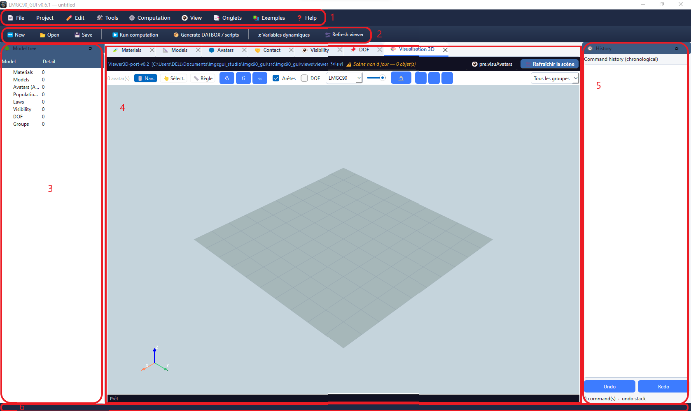

The interface is divided into **six main areas**:

1. **Menu**
2. **Toolbar** (top)
3. **Model tree** (left)
4. **Creation tabs** (centre)
5. **Command history** (right)
6. **Status bar** (bottom)

The **command palette** is available from the **toolbar** or with the keyboard shortcut `Ctrl+K`.

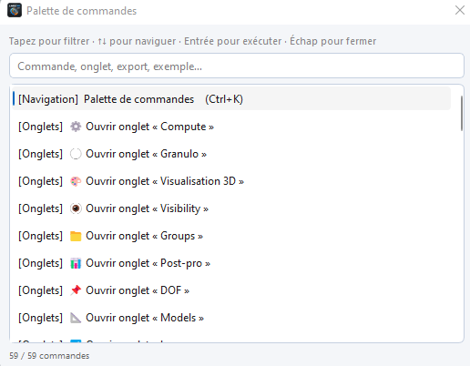

---

## 1. Menu

### 1.1 File

| Action | Shortcut | Description |
|--------|----------|-------------|
| **New** | `Ctrl+N` | Creates a new project. A dialog opens to enter the dimension and project name. |
| **Open** | `Ctrl+O` | Opens an existing project. A dialog lets you browse to the project `.lmgc90` file. |
| **Save** | `Ctrl+S` | Saves the current project to its current location. |
| **Save As…** | `Ctrl+Shift+S` | Saves the project under a new name or in a new location. |
| **Quit** | `Ctrl+Q` | Closes the application. |

**New project**

Click the **New** button on the toolbar, use **File → New**, or press `Ctrl+N`. A dialog opens to set the dimension then the project name.

  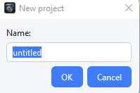

**Open a project**

Click the **Open** button on the toolbar, use **File → Open**, or press `Ctrl+O`. Then specify the path and name of your project.

  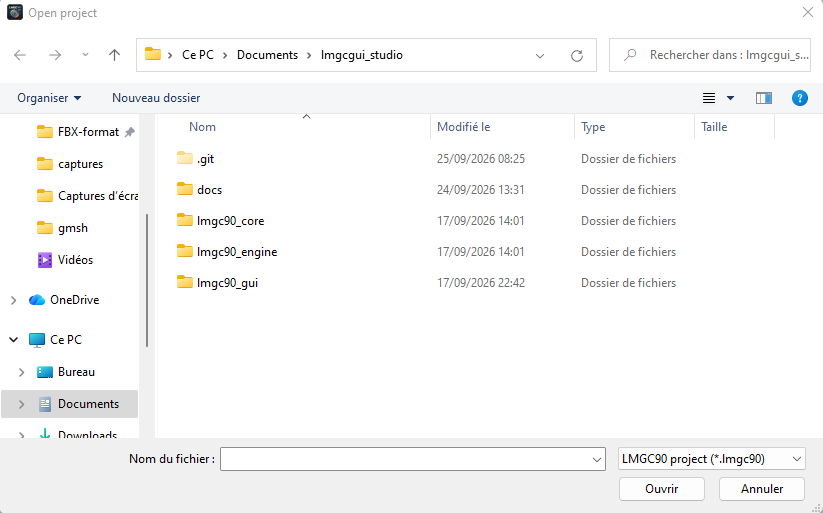

**Save**
  Saves your projects to disk: click the **Save** button on the toolbar, use **File → Save**, or the shortcut `Ctrl+S`.

---

#### 1.2 Project

**Set dimension**
To keep the same dimension throughout your project you can click **Project → Set dimension**.
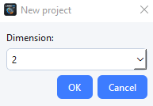

#### 1.3 Edit

| Action | Shortcut | Description |
|--------|----------|-------------|
| **Undo** | `Ctrl+Z` | Undo an action. |
| **Redo** | `Ctrl+Y` | Redo the undone action. |

#### 1.4 Tools

| Action | Shortcut | Description |
|--------|----------|-------------|
| **Generate pre.py** | — | Generates your model script (`pre.py`). |
| **Generate command.py** | — | Generates your computation script (`command.py`). |
| **Export all** | — | Exports model/computation scripts and DATBOX. |
| **Pipeline** | — | Generates your sbatch script for an HPC machine. |
| **Deformable assistant** | `Ctrl+Shift+D` | Guides creation or import of deformable elements (rectangle, disk, sphere, cylinder meshes or external `.msh` / `.geo` files, etc.). |
| **Masonry assistant** | `Ctrl+Shift+M` | Specialised in creating 2D and 3D brick stacks (`brick2D` / `brick3D`) with various bonds (standard, running bond, single stretcher, double stretcher, etc.). |
| **Dynamic variables** | `Ctrl+V` | Opens a dialog to define reusable variables in the interface numeric fields (radius, spacing, offset, etc.). It is also an inspection window for properties of LMGC90 objects in memory. See [Dynamic variables](dynam_variables.md). |
| **visuAvatars (pylmgc90)** | — | Visualises your model with the native LMGC90 ``visuAvatars`` function. |
| **Preferences** | `Ctrl+,` | Opens the application configuration dialog. See [Preferences](#preferences). |

> **Note:** assistants can be relaunched at any time during the session. Each run appends generated elements to the existing project without clearing what was created before.
Duplicate elements that share the same name cause errors; name your elements differently.

---

#### 1.5 Compute

| Action | Shortcut | Description |
|--------|----------|-------------|
| **Generate DATBOX and scripts** | `Ctrl+F5` | Generates DATBOX and model/computation scripts. |
| **Run computation** | `F5` | Opens the compute tab and runs the chipy computation directly from the interface, in a separate process so the UI is not blocked. |
| **Application log** | `F7` | Shows the internal LMGC90_GUI log: unhandled errors, Python warnings, failed pylmgc90 calls. Useful to diagnose issues that do not show a visible message in the UI. |

---

#### 1.6 Tabs

| Action | Shortcut | Description |
|--------|----------|-------------|
| **Open** | — | Opens a specific tab from the full list. See [Creation tabs](#4-creation-tabs-central-area). |
| **Close others** | — | Closes all open tabs except the active one. |
| **Close all (except essential)** | — | Closes all non-essential tabs. |
| **Default tabs** | `Ctrl+Alt+D` | Restores the default tab layout. |

 ---

#### 1.7 Examples

This menu has a single action, **Example library**, which opens a dialog where you can browse several examples under seven categories. Selecting an example loads its details in the right panel.

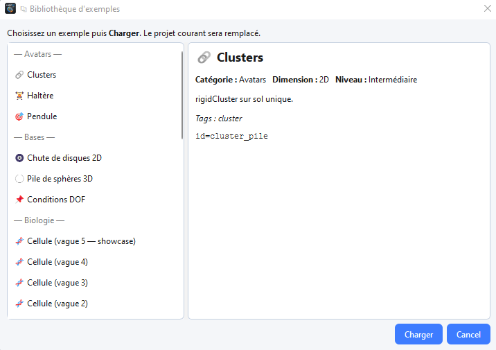

To load an example, select it and click **Load**. A new dialog then asks whether to **replace**, **add to the project** (which may create duplicates) or **cancel**.

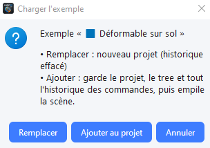

---

#### 1.8 Help

| Action | Description |
|--------|-------------|
| **Command palette** | Opens the command palette. |
| **About** | Shows version information for LMGC90_GUI and its dependencies. |
| **Online help** | Opens the online documentation in the default browser. |

---

### 2. Toolbar

The toolbar groups the most frequent actions for quick access:

| Button | Menu equivalent |
|--------|-----------------|
| **New** | File → New |
| **Open** | File → Open |
| **Run computation** | Compute → Run computation |
| **Save** | File → Save |
| **Generate DATBOX/scripts** | Compute → Generate DATBOX/scripts |
| **Dynamic variables** | Tools → Dynamic variables |
| **Command palette** | Help → Command palette |

---

### 3. Model tree (left)

Fixed area showing the **model tree**. It updates automatically after each creation, modification or deletion of an element.

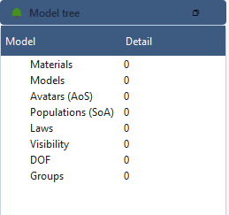

#### Displayed sections

| Section | Content |
|---------|---------|
| **Materials** | List of all materials defined in the project. |
| **Models** | List of all finite-element models (physics, element, dimension). |
| **Avatars (AOS)** | List of all bodies in the project: rigid, empty, deformable, Loop, ForLoop, etc. |
| **Avatar populations (SOA)** | List of granulometry or assistants. |
| **Contact laws** | Defined contact behaviour laws (friction, cohesion, stiffness). |
| **Visibility tables** | Visibility rules between avatars during computation. |
| **DOF** | Boundary conditions on avatars or avatar groups. |
| **Groups** | List of avatar groups. |

---

### 4. Creation tabs (central area)

Main work area. Each tab is dedicated to one modelling step. To open a tab, use **Tabs → Open** and choose the desired tab.

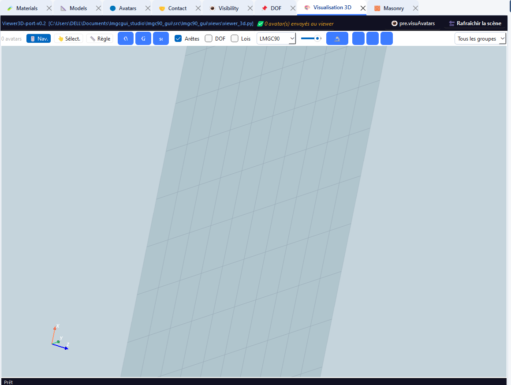

| Tab | Shortcut | Description |
|-----|----------|-------------|
| **Material** | `Ctrl+1` | Creation and management of materials (RIGID, ELAS, ELAS_PLAS, THERMO_ELAS, PORO_ELAS, etc.). |
| **Model** | `Ctrl+2` | Definition of physical models and finite elements (MECAx, THERx, POROx, MULTI). |
| **Avatar** | `Ctrl+3` | Creation of standard rigid bodies: disk, rod, polygon, rough wall, sphere, cylinder, polyhedron, etc. |
| **Loops** | `Ctrl+4` | Parametric generation of avatar series: circle, grid, line, spiral or manual placement. |
| **ForLoop** | `Ctrl+5` | Creates For loops on your elements: materials, models, avatars, DOF, etc. |
| **Granulometry** | `Ctrl+6` | Generation of deposits with statistical radius distribution and gravitational deposit. |
| **Contact** | `Ctrl+7` | Definition of contact behaviour laws (Coulomb friction, cohesion, normal and tangential stiffness). |
| **Visibility** | `Ctrl+8` | Creation of visibility tables with which avatars interact during computation. |
| **DOF** | `Ctrl+9` | Boundary conditions: imposed translations, locked rotations, imposed velocities, DOF couplings. |
| **Postpro** | — | Configuration of post-processing commands: energy balance, body tracking, field extraction. |
| **3D Visualisation** | — | Interactive display of model avatars with navigation, selection and measurement modes. |
| **Groups** | — | Configure your avatar groups. |
| **Contactors** | — | Add/remove contactors for your avatars. |
| **Deformable assistant** | — | Assistant for creating/importing deformable elements. |
| **Masonry assistant** | — | Assistant for creating and configuring masonry elements. |

> **Keyboard shortcuts:** keys `Ctrl+1` to `Ctrl+9` open the first nine tabs in the list directly.

---

### 5. Command history area (right)

Area dedicated to managing command history.

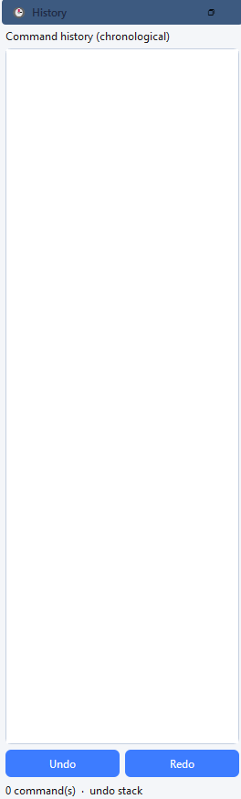

---

### 6. Status bar (bottom)

Horizontal strip at the bottom of the window showing contextual messages about ongoing operations: avatar creation, script generation, measurement result in the 3D viewer, validation error, etc.

---

### Interactive modes of the 3D viewer

| Mode | Description |
|------|-------------|
| **🖱️ Navigation** | Default mode: rotate (left click + drag), zoom (wheel), pan (right click + drag). |
| **👆 Selection** | Click an avatar to highlight it (yellow highlight) and show its information in the status bar. |
| **📏 Ruler** | Distance measurement: click a first point (A) then a second point (B) to display the distance in metres. |

Quick views **XY**, **XZ**, **YZ** and **Iso** are available from the viewer toolbar.

---

### Preferences

Accessible via **Tools → Preferences** or the shortcut `Ctrl+,`. The preferences dialog groups application configuration settings.

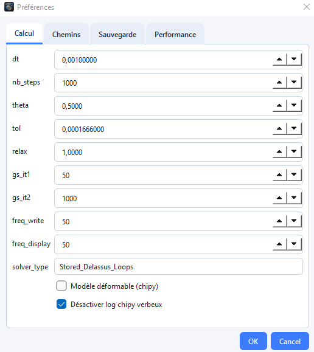

| Setting | Description |
|---------|-------------|
| **Compute** | Contains default computation values. |
| **Paths** | Default path used when opening and saving projects. |
| **Save** | Options to enable automatic save at regular intervals and on application close. |
| **Performance** | Enables or disables display of avatars in the model tree and in the Avatar tab table. |

---

## Keyboard shortcut summary

| Shortcut | Action |
|----------|--------|
| `Ctrl+N` | New project |
| `Ctrl+O` | Open a project |
| `Ctrl+S` | Save |
| `Ctrl+Shift+S` | Save As… |
| `Ctrl+Q` | Quit |
| `Ctrl+Shift+N` | Project configuration assistant |
| `Ctrl+Shift+G` | pylmgc90 granulometry assistant |
| `Ctrl+Shift+D` | Deformable assistant |
| `Ctrl+Shift+M` | Masonry assistant |
| `Ctrl+V` | Dynamic variables |
| `Ctrl+,` | Preferences |
| `Ctrl+F5` | Computation parameters |
| `F5` | Run computation |
| `F6` | View LMGC90 logs |
| `F7` | Application log |
| `Ctrl+Alt+D` | Default tabs |
| `Ctrl+1` … `Ctrl+9` | Open the corresponding tab |
| `Ctrl+K` | Open the command palette |

---

LMGC90_GUI is designed to be **intuitive** and **fully visual**, while remaining fully compatible with traditional LMGC90 Python scripts.

For specific operations, see the chapters in the [English index](overview.md).
