# LMGC90 Studio — Architecture détaillée

> **Version :** 0.6.0  > **Auteur :** bzerourou  > **diagrammes de classes** et **diagrammes de séquences** pour l’architecture **core / engine / gui**.
---

## Table des matières

1. [Vue d’ensemble](#1-vue-densemble)
2. [Diagramme de classes — core](#2-diagramme-de-classes--lmgc90_core)
3. [Diagramme de classes — engine](#3-diagramme-de-classes--lmgc90_engine)
4. [Diagramme de classes — gui](#4-diagramme-de-classes--lmgc90_gui)
5. [Diagramme de classes — transversal](#5-diagramme-de-classes--vue-transversale)
6. [Séquences — CRUD & historique](#6-séquences--crud--historique)
7. [Séquences — materialize & DATBOX](#7-séquences--materialize--datbox)
8. [Séquences — granulo](#8-séquences--granulo)
9. [Séquences — ForLoop multi-cibles](#9-séquences--forloop-multi-cibles)
10. [Séquences — ouverture projet / Undo](#10-séquences--ouverture-projet--undo)
11. [Séquences — visu & export scripts](#11-séquences--visu--export-scripts)
12. [Règles d’architecture](#12-règles-darchitecture)

---

## 1. Vue d’ensemble

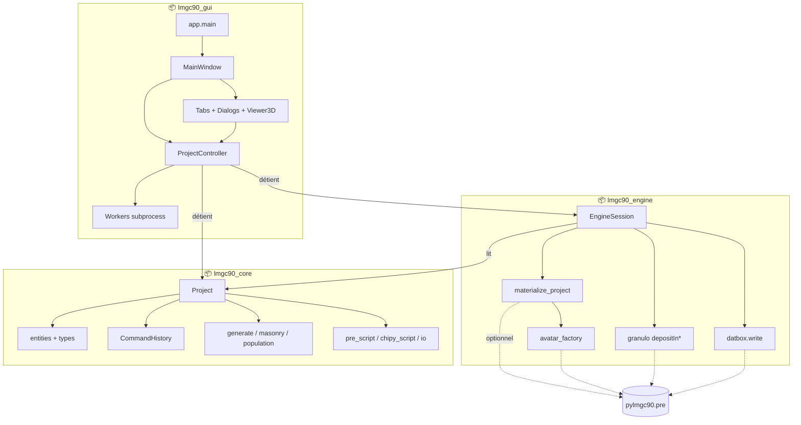

| Package | Rôle | Dépendances |
|---------|------|-------------|
| **core** | Vérité du modèle, Undo, sérialisation, scripts | Python + NumPy |
| **engine** | Matérialisation live, DATBOX, dépôts natifs | core + pylmgc90 *optionnel* |
| **gui** | Interface MVC | core + engine + PyQt6 (+ PyVista) |

---

## 2. Diagramme de classes — `lmgc90_core`

### 2.1 Project et agrégats

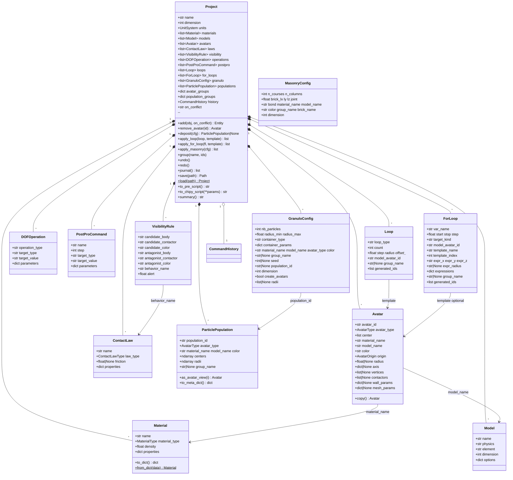

### 2.2 Historique de commandes (Undo / Redo)

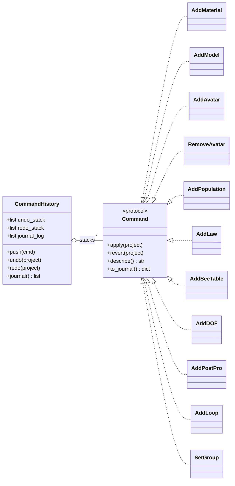

### 2.3 Types & validation (extrait)

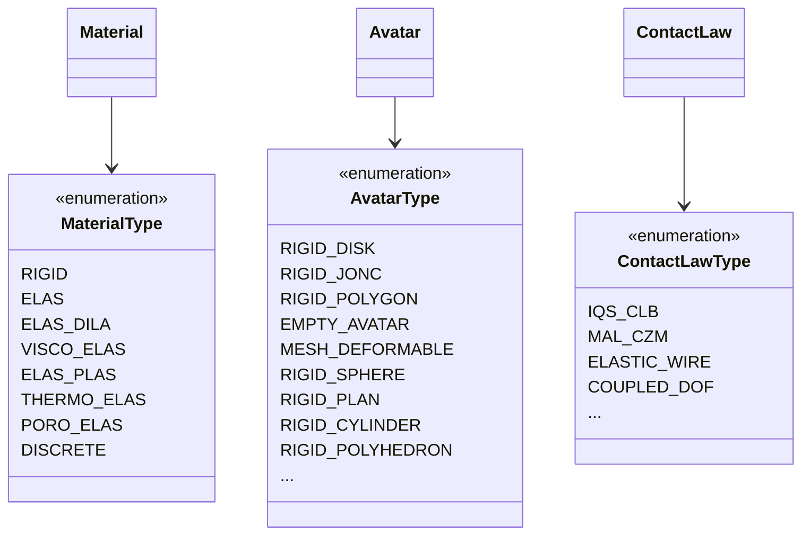

Constantes associées : `MATERIAL_PROPERTY_SCHEMA`, `ORTHOTROPIC_FIELDS_2D/3D`, `CONTACTORS_RIGID_2D/3D`, `CONTACT_LAW_PROPERTY_SCHEMA`.

---

## 3. Diagramme de classes — `lmgc90_engine`

```mermaid
classDiagram
  direction TB

  class EngineSession {
    +Project project
    +MaterializedScene|None _scene
    +bool _dirty
    --
    +mark_dirty()
    +materialize(force) MaterializedScene
    +write_datbox(path, ...)
    +visu_avatars(force)
    +emit_pre_script(path) str
    +emit_chipy_script(...) str
    +export_all(outdir)
    +run_granulo(cfg) ParticlePopulation
    +available() bool
  }

  class MaterializedScene {
    +Any materials_container
    +Any models_container
    +Any bodies_container
    +dict material_by_name
    +dict model_by_name
    +dict body_by_avatar_id
    +dict law_by_name
    +int dimension
    +str project_name
  }

  class materialize_project {
    <<function>>
    +materialize_project(project) MaterializedScene
  }

  class avatar_factory {
    <<module>>
    +build_avatar(av, materials, models) body
    +build_population_bodies(pop, ...) list
    +expand_rigids_from_mesh2d(...)
    +_build_empty_avatar(...)
    +_build_brick2d(...)
    +_apply_contactors(body, av)
  }

  class granulo {
    <<module>>
    +run_granulo(config) ParticlePopulation
    +_call_deposit(pre, config)
  }

  class datbox {
    <<module>>
    +write_datbox(scene, path, ...)
  }

  EngineSession --> MaterializedScene : _scene
  EngineSession --> Project : project
  EngineSession ..> materialize_project
  materialize_project ..> avatar_factory
  EngineSession ..> granulo
  EngineSession ..> datbox
  MaterializedScene ..> "pylmgc90.pre" : containers live
```

**Chaîne materialize (ordre)** :

1. `pre.materials()` ← chaque `Material` (`_make_material`, orthotrope → listes `young`/`nu`/`G`)
2. `pre.models()` ← chaque `Model` (`dimension` ∈ {2,3}, nom 5 car.)
3. Bodies ← `build_avatar` / populations / mesh expand
4. `tact_behav` ← lois
5. `see_table` ← visibility
6. DOF ← `imposeDrivenDof` / evolution / …

---

## 4. Diagramme de classes — `lmgc90_gui`

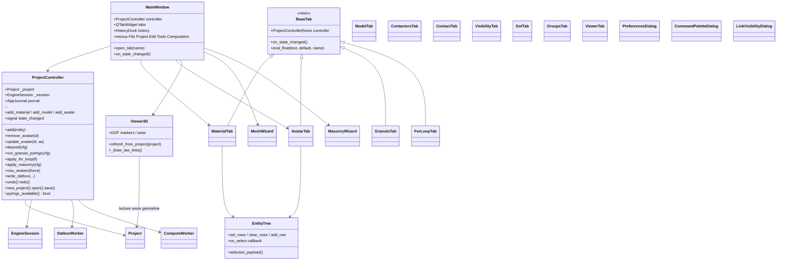

---

## 5. Diagramme de classes — vue transversale

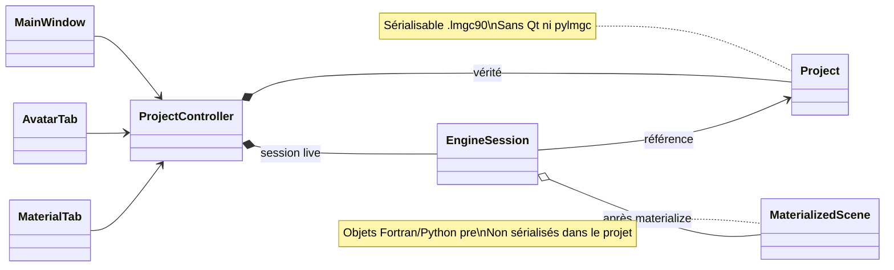

---

## 6. Séquences — CRUD & historique

### 6.1 Ajout d’un matériau

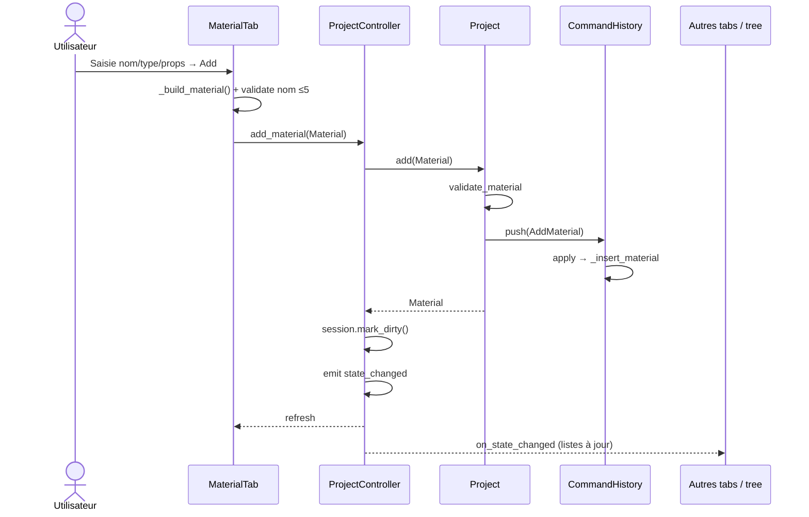

### 6.2 Suppression d’un avatar

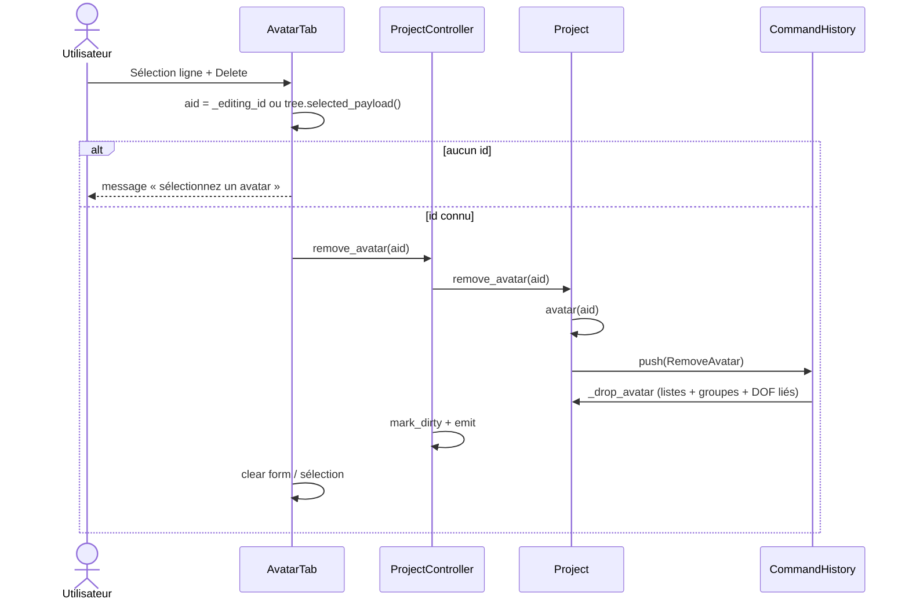

### 6.3 Undo

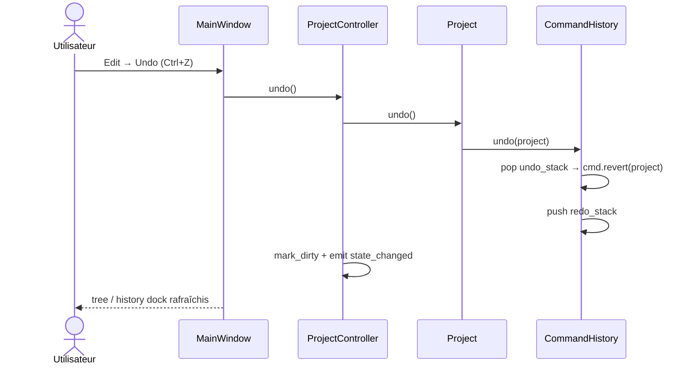

---

## 7. Séquences — materialize & DATBOX

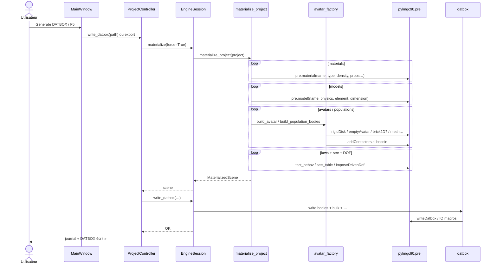

### emptyAvatar (détail)

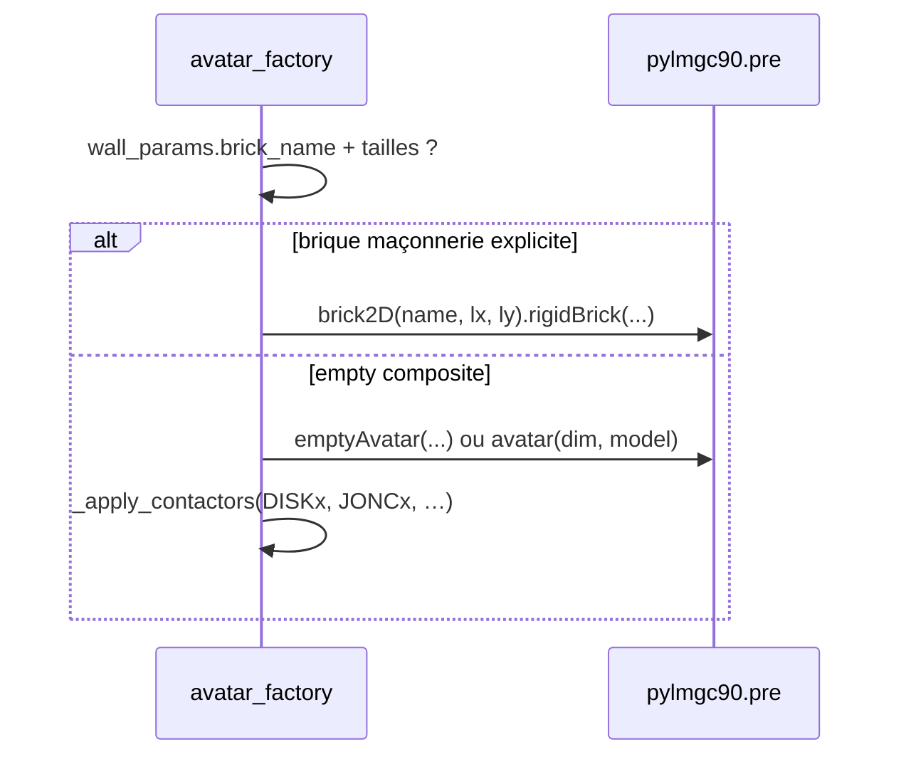

---

## 8. Séquences — granulo

### 8.1 Distribution seule (sans avatars)

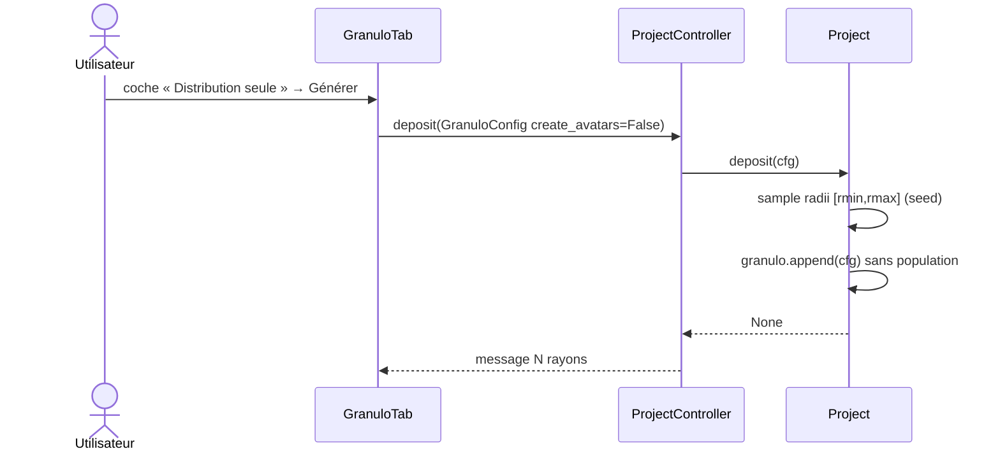

### 8.2 Dépôt SoA ou pylmgc

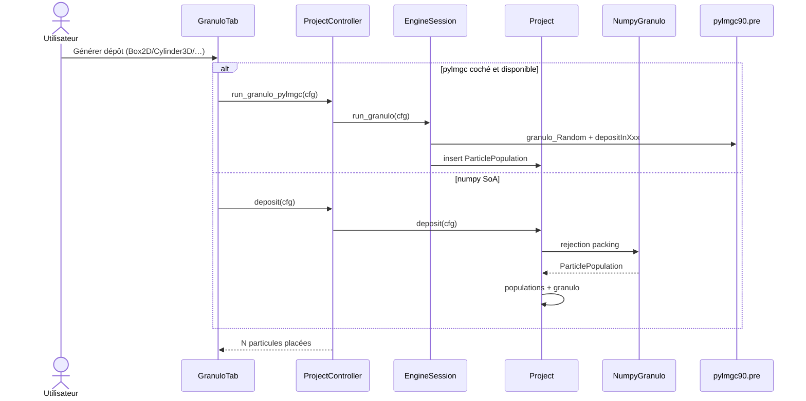

---

## 9. Séquences — ForLoop multi-cibles

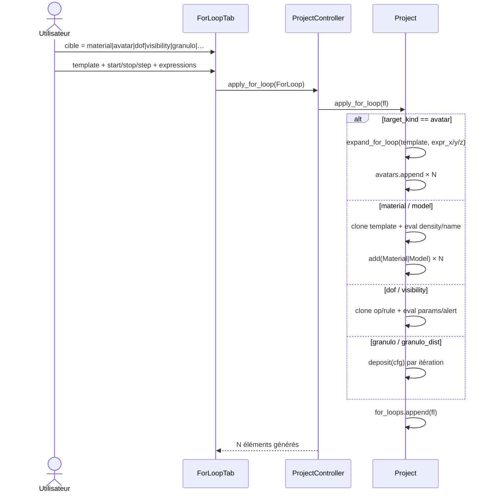

---

## 10. Séquences — ouverture projet / Undo

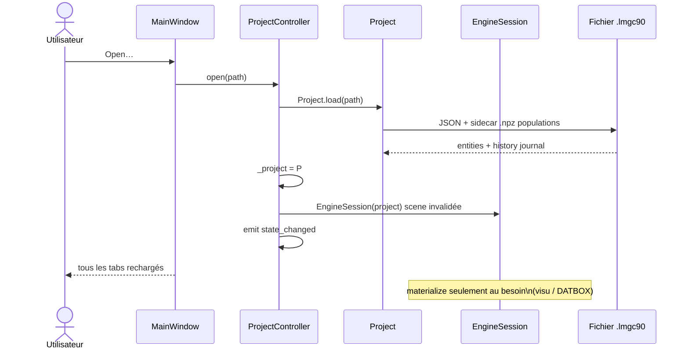

---

## 11. Séquences — visu & export scripts

### 11.1 Viewer paramétrique (sans materialize obligatoire)

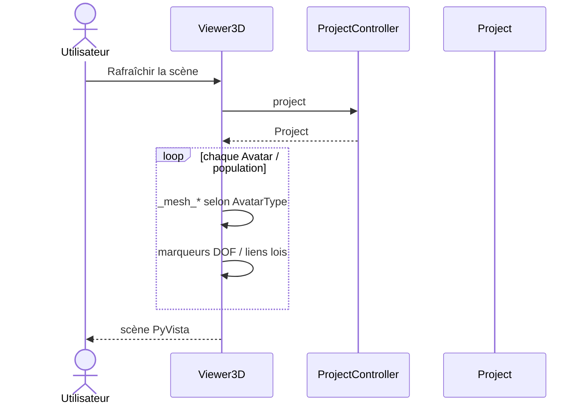

### 11.2 pre.visuAvatars (pylmgc)

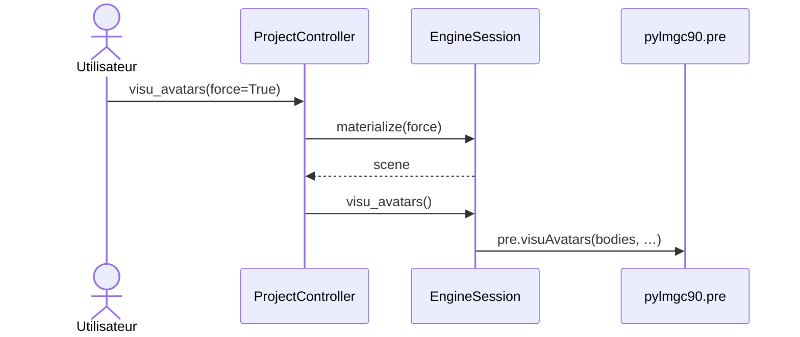

### 11.3 Export pre.py (core pur)

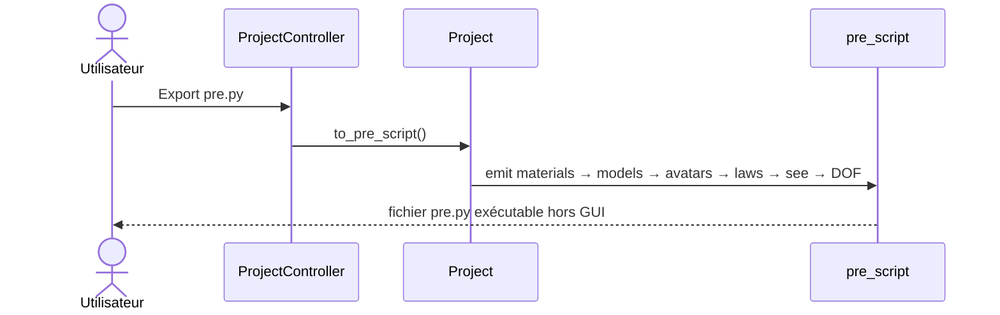

---

## 12. Règles d’architecture

1. **Source de vérité** = `lmgc90_core.Project` (jamais les containers pylmgc).
2. **core** : zéro import Qt / pylmgc90 (tests headless).
3. **engine** : matérialise à la demande ; `mark_dirty` après toute mutation GUI.
4. **gui** : `ProjectController` = unique façade ; tabs ne touchent pas `pre` directement (sauf helpers `pre.*` **core** pour construire des entities).
5. **Noms LMGC90** = 5 caractères à l’export / materialize.
6. **emptyAvatar** ≠ brick : brick seulement si `wall_params.brick_name` + dimensions.
7. **Exemples** = `def scene(project) -> None` en entities core, pas de scripts Fortran dans core.

---

*Architecture Studio — classes & séquences détaillées (core / engine / gui).*
